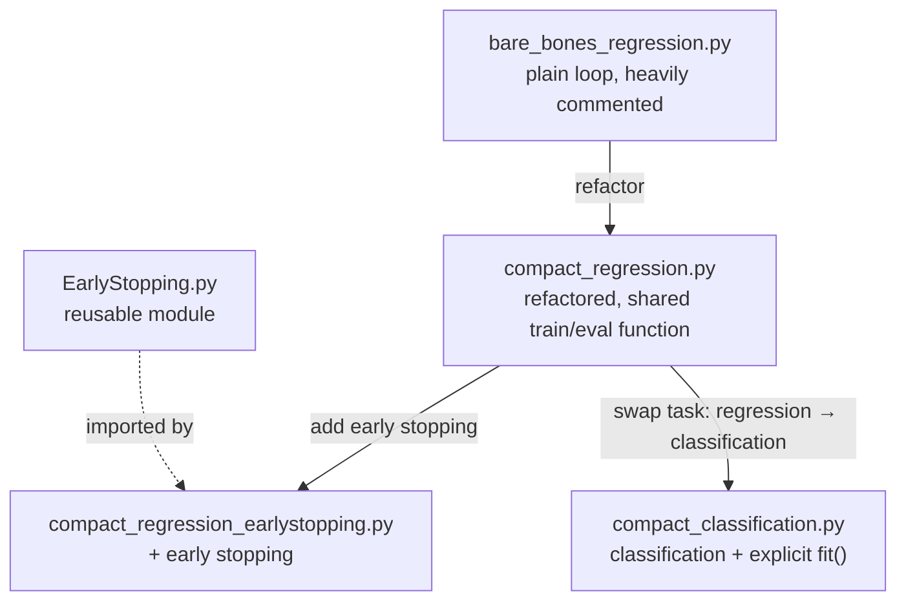

# basics_pytorch

A personal refresher on raw PyTorch. I spent a long time in PyTorch Lightning and want to rebuild the fundamentals by hand before tackling harder projects like GANs.

Each script is a small, runnable step. Later scripts are built by modifying earlier ones, so reading them in order shows how a training loop grows.

## How the files grow



## Reading order

| # | File | Builds on | What it adds |
|---|------|-----------|--------------|
| 1 | `bare_bones_regression.py` | – | Regression on the California Housing dataset with a plain training loop. Heavily commented, meant as the teaching baseline. |
| 2 | `compact_regression.py` | 1 | Same task, much shorter. One epoch function handles both training and validation, toggling `torch.no_grad()` depending on whether an optimizer is passed. Compact, but easy to get wrong if you forget the optimizer. |
| 3 | `EarlyStopping.py` | – | A reusable early stopping module (generated with Claude, kept as a standalone component). |
| 4 | `compact_regression_earlystopping.py` | 2, 3 | The compact regression script with early stopping wired into the loop. |
| 5 | `compact_classification.py` | 2 | Classification on the digits dataset, with an explicit `fit()` function. |

## Running

```bash
pip install -e .          # dependencies are declared in pyproject.toml
python bare_bones_regression.py
python compact_regression_earlystopping.py
python compact_classification.py
```

## Roadmap

- [x] Early stopping
- [ ] Model checkpoints with Lightning-style naming
- [ ] TensorBoard and CSV logging
- [ ] tqdm progress bars
